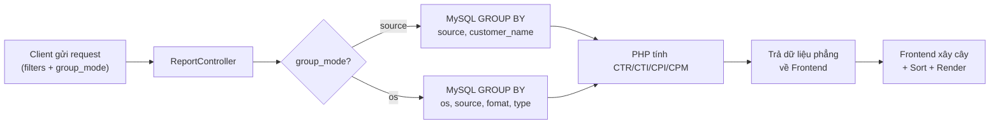

# Thiết kế: Cập nhật trang Report

## Tổng quan

Cập nhật trang Report với 5 thay đổi chính:
1. Đẩy tính toán gom nhóm xuống MySQL để xử lý dữ liệu lớn
2. Thêm chế độ nhóm mới: OS → Source → Format → Type (Accordion đa cấp)
3. Toggle chuyển đổi giữa 2 chế độ nhóm trên FilterBar
4. Nút "Lọc" dạng Modal/Popup gộp Source + Region (+ OS/Format/Type ở chế độ mới)
5. Sắp xếp (Sort) thực hiện tại frontend cho phản hồi tức thì

## Kiến trúc dữ liệu

### Bảng MySQL: `split_campaigns__dbt_tmp`

Các cột liên quan:
```
date, source, campaign_name, customer_name, os, region, fomat, type,
impressions, clicks, installs, cost_usd, cost_vnd
```

### Luồng dữ liệu



---

## 1. Backend — ReportController

### Chế độ cũ (`group_mode=source`)

```sql
SELECT
    source,
    customer_name,
    SUM(clicks) as clicks,
    SUM(impressions) as impressions,
    SUM(installs) as installs,
    SUM({costField}) as cost
FROM split_campaigns__dbt_tmp
WHERE date BETWEEN ? AND ?
  -- các filter khác: customer_name, sources[], regions[]
GROUP BY source, customer_name
HAVING SUM(clicks) > 0 OR SUM(impressions) > 0
    OR SUM(installs) > 0 OR SUM({costField}) > 0
```

PHP nhận kết quả phẳng, mỗi dòng = 1 cặp `(source, customer_name)`.
PHP tính thêm CTR, CTI, CPI, CPM rồi trả về frontend.
Frontend tự xây cây: Source (cha) → Customer Name (con).

### Chế độ mới (`group_mode=os`)

```sql
SELECT
    COALESCE(NULLIF(os, ''), 'Unknown') as os,
    COALESCE(NULLIF(source, ''), 'Unknown') as source,
    COALESCE(NULLIF(fomat, ''), 'Unknown') as fomat,
    COALESCE(NULLIF(type, ''), 'Unknown') as type,
    SUM(clicks) as clicks,
    SUM(impressions) as impressions,
    SUM(installs) as installs,
    SUM({costField}) as cost
FROM split_campaigns__dbt_tmp
WHERE date BETWEEN ? AND ?
  -- các filter khác
GROUP BY os, source, fomat, type
HAVING SUM(clicks) > 0 OR SUM(impressions) > 0
    OR SUM(installs) > 0 OR SUM({costField}) > 0
```

PHP tính thêm CTR, CTI, CPI, CPM.
Frontend tự xây cây 4 cấp: OS → Source → Format → Type.

### Summary (Tổng)

Tính riêng bằng 1 query aggregate đơn giản (không cần GROUP BY):

```sql
SELECT
    SUM(clicks), SUM(impressions), SUM(installs), SUM({costField})
FROM split_campaigns__dbt_tmp
WHERE date BETWEEN ? AND ? ...
```

### Danh sách filter options

Backend trả thêm các danh sách distinct để hiển thị trong Modal Lọc:
- `allSources` — đã có sẵn
- `allRegions` — **MỚI**: `SELECT DISTINCT region FROM ... WHERE date BETWEEN ...`
- Ở chế độ `os`: thêm `allOs`, `allFormats`, `allTypes`

### Tham số Request mới

| Tham số | Mô tả | Giá trị mặc định |
|---|---|---|
| `group_mode` | Chế độ nhóm | `'source'` |
| `regions[]` | Mảng region đã chọn | `[]` |
| `os_filter[]` | Mảng OS đã chọn (chế độ os) | `[]` |
| `formats[]` | Mảng Format đã chọn (chế độ os) | `[]` |
| `types[]` | Mảng Type đã chọn (chế độ os) | `[]` |

---

## 2. Frontend — Xây dựng cây từ dữ liệu phẳng

### Chế độ cũ (Source → Customer)

```
Dữ liệu phẳng từ backend:
[
  { source: "Facebook", customer_name: "ABC", clicks: 100, ... },
  { source: "Facebook", customer_name: "XYZ", clicks: 50, ... },
  { source: "Google", customer_name: "ABC", clicks: 200, ... },
]

→ Frontend xây thành:
[
  { label: "Facebook", clicks: 150, ..., children: [
    { label: "ABC", clicks: 100, ... },
    { label: "XYZ", clicks: 50, ... },
  ]},
  { label: "Google", clicks: 200, ..., children: [
    { label: "ABC", clicks: 200, ... },
  ]},
]
```

### Chế độ mới (OS → Source → Format → Type)

```
Dữ liệu phẳng từ backend:
[
  { os: "Android", source: "Facebook", fomat: "Video", type: "CPI", clicks: 100, ... },
  { os: "Android", source: "Facebook", fomat: "Video", type: "CPA", clicks: 50, ... },
  { os: "Android", source: "Facebook", fomat: "Banner", type: "CPI", clicks: 30, ... },
  { os: "iOS", source: "Google", fomat: "Unknown", type: "CPI", clicks: 200, ... },
]

→ Frontend xây thành:
[
  { label: "Android", clicks: 180, ..., children: [
    { label: "Facebook", clicks: 180, ..., children: [
      { label: "Video", clicks: 150, ..., children: [
        { label: "CPI", clicks: 100, ... },
        { label: "CPA", clicks: 50, ... },
      ]},
      { label: "Banner", clicks: 30, ..., children: [
        { label: "CPI", clicks: 30, ... },
      ]},
    ]},
  ]},
  { label: "iOS", clicks: 200, ..., children: [
    { label: "Google", clicks: 200, ..., children: [
      { label: "Unknown", clicks: 200, ..., children: [
        { label: "CPI", clicks: 200, ... },
      ]},
    ]},
  ]},
]
```

### Hàm xây cây (`buildTree`)

Một hàm utility nhận:
- `flatData`: Mảng dữ liệu phẳng từ backend
- `groupKeys`: Mảng các key để nhóm theo thứ tự. VD: `['os', 'source', 'fomat', 'type']`

Trả về mảng cây đã tính tổng cho mỗi nút cha.

---

## 3. DataTable — Accordion đa cấp

### Cấu trúc render

- **Cấp 1** (OS hoặc Source): Nền đậm, font bold, có icon ▶ xoay khi mở
- **Cấp 2**: Thụt lề 20px, nền nhạt hơn, có icon ▶
- **Cấp 3**: Thụt lề 40px, nền nhạt hơn nữa, có icon ▶
- **Cấp 4** (lá): Thụt lề 60px, không có icon mở rộng

### Hành vi Expand/Collapse

- Bấm dòng Cấp 1 → Toggle hiển thị các dòng Cấp 2 bên dưới
- Bấm dòng Cấp 2 → Toggle hiển thị các dòng Cấp 3
- Bấm dòng Cấp 3 → Toggle hiển thị các dòng Cấp 4
- Collapse cha → tự động ẩn hết con/cháu

### Sắp xếp (Sort) — Frontend

- Giữ nguyên `useMemo` sort hiện tại, nhưng chỉ sort các dòng **cùng cấp**.
- VD: Sort theo clicks desc → các dòng OS sắp xếp theo tổng clicks giảm dần. Bên trong mỗi OS, các dòng Source cũng xếp theo clicks giảm dần. Tương tự cho các cấp sâu hơn.

### Cột hiển thị

| Cột | Ý nghĩa |
|---|---|
| `Nhóm` | Tên nút (OS, Source, Format, Type, hoặc Customer Name tùy chế độ) |
| `Clicks` | Tổng clicks |
| `Impressions` | Tổng impressions |
| `Installs` | Tổng installs |
| `Cost` | Tổng chi phí |
| `CTR (%)` | Click-through rate |
| `CTI (%)` | Click-to-install rate |
| `CPI` | Cost per install |
| `CPM` | Cost per mille |

---

## 4. FilterBar — Toggle chế độ nhóm

Thêm một nhóm nút toggle (giống currency toggle đã có) với 2 lựa chọn:

```
| Theo Source | Theo OS |
```

- `Theo Source` → `group_mode=source` (chế độ cũ)
- `Theo OS` → `group_mode=os` (chế độ mới)
- Khi chuyển chế độ → gọi `onFilterChange({ group_mode: '...' })` → Backend trả dữ liệu theo kiểu gom nhóm tương ứng

---

## 5. FilterBar — Nút "Lọc" dạng Modal

### Giao diện

Nút "Lọc" trên FilterBar (thay thế Dropdown "Lọc Source" hiện tại). Bấm vào mở Modal/Popup giữa màn hình:

```
┌─────────────────────────────────────────────────┐
│                     Bộ lọc                      │
├─────────────────────────────────────────────────┤
│                                                 │
│  Source                                         │
│  ┌──────────┐ ┌──────────┐ ┌──────────┐        │
│  │ Facebook │ │  Google  │ │  TikTok  │ ...    │
│  └──────────┘ └──────────┘ └──────────┘        │
│                                                 │
│  Region                                        │
│  ┌──────────┐ ┌──────────┐ ┌──────────┐        │
│  │    VN    │ │    US    │ │    JP    │ ...    │
│  └──────────┘ └──────────┘ └──────────┘        │
│                                                 │
│  ── Chỉ hiện ở chế độ "Theo OS" ──             │
│                                                 │
│  OS                                             │
│  ┌──────────┐ ┌──────────┐                      │
│  │ Android  │ │   iOS    │                      │
│  └──────────┘ └──────────┘                      │
│                                                 │
│  Format                                         │
│  ┌──────────┐ ┌──────────┐ ┌──────────┐        │
│  │  Video   │ │  Banner  │ │  Native  │ ...    │
│  └──────────┘ └──────────┘ └──────────┘        │
│                                                 │
│  Type                                           │
│  ┌──────────┐ ┌──────────┐                      │
│  │   CPI    │ │   CPA    │                      │
│  └──────────┘ └──────────┘                      │
│                                                 │
├─────────────────────────────────────────────────┤
│          [ Đóng ]          [ Xem kết quả ]      │
└─────────────────────────────────────────────────┘
```

### Hành vi

- Mỗi chip/tag là nút toggle: bấm lần 1 = chọn (highlight xanh), bấm lần 2 = bỏ chọn
- Mặc định: không chọn gì = lấy tất cả (tương đương hiện tại)
- **"Đóng"**: Đóng modal, không áp dụng thay đổi
- **"Xem kết quả"**: Đóng modal + gọi `onFilterChange` với các giá trị đã chọn → tải lại dữ liệu từ backend

---

## 6. Danh sách file thay đổi

### Backend
- **[MODIFY]** [ReportController.php](file:///d:/laravel/BaoCaoQC/app/Http/Controllers/ReportController.php) — Viết lại query dùng MySQL GROUP BY, thêm xử lý `group_mode`, `regions`, `os_filter`, `formats`, `types`

### Frontend
- **[MODIFY]** [Index.jsx](file:///d:/laravel/BaoCaoQC/resources/js/Pages/Report/Index.jsx) — Nhận thêm props mới, truyền `groupMode` xuống DataTable và FilterBar
- **[MODIFY]** [DataTable.jsx](file:///d:/laravel/BaoCaoQC/resources/js/Pages/Report/DataTable.jsx) — Viết lại thành Accordion đa cấp, thêm hàm `buildTree`, sort frontend
- **[MODIFY]** [FilterBar.jsx](file:///d:/laravel/BaoCaoQC/resources/js/Pages/Report/FilterBar.jsx) — Thêm toggle chế độ nhóm, thay Dropdown Source bằng nút "Lọc"
- **[NEW]** [FilterModal.jsx](file:///d:/laravel/BaoCaoQC/resources/js/Pages/Report/FilterModal.jsx) — Component Modal lọc với chip/tag UI

### CSS
- **[MODIFY]** [app.css](file:///d:/laravel/BaoCaoQC/resources/css/app.css) — Thêm styles cho Modal, chip/tag, tree indentation, toggle nhóm
